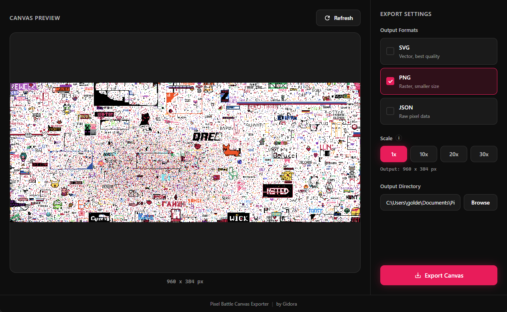

# Majestic Pixel Battle Exporter

Majestic Pixel Battle Canvas Exporter is a desktop tool that downloads the Pixel Battle canvas and reconstructs it into clean **SVG**, **PNG**, or **JSON** files without compression or visual artefacts.

Built with **Electron**, **React**, and **Vite**.

## Features

- Download the full Pixel Battle canvas
- Export to:
  - **SVG** (vector, lossless)
  - **PNG** (raster)
  - **JSON** (raw pixel data)
- Adjustable scale for high-resolution exports
- No compression, no blur, no artefacts
- Simple and fast desktop UI

## Build

Windows portable build
`npm run build:win`

## Tech Stack

- Electron
- React
- Vite
- TypeScript
- Jimp (image processing)

## License

MIT © GoldenGidora

